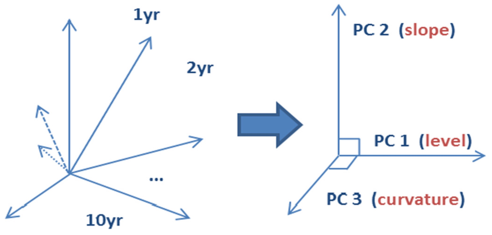

# Back testing 

Backtesting means the process of testing a trading strategy on historical data to assess its accuracy.
Though, no funds are invested in reality. Backtesting is based on the phenomenon that, the strategy
which performed well in the past, is expected to work well in the future. 

Backtesting allows a trader to simulate a trading strategy using historical data to generate results and analyze risk and profitability before risking any actual capital. As long as a trading idea can be quantified, it can be
backtested. 

Typically, this involves a programmer coding the idea into the proprietary language
hosted by the trading platform.

### Statistical modelling  

- **Regression** 

- **Clustering** 

- **PCA , principal component analysis** 

        

- **The autocovariance function (ACF)** is a very useful statistical tool for studying the dependence properties of a time series. The ACF is our formal tool for detecting non-stationarity in a time series. Plotting and visualizing the correlation structure of the series is the second step after plotting and visualizing the series itself.

## Neural nets for predictions 

Recently with the advent of Neural Networks and deep learning . I came accross a couple of papers that seem to indicate the use of such kind of techniques to be employed in the purpose of predictions .

Deep learning is involved a lot in the modern quantitive financial field. The recurrent neural network, to be specific, the Long Short Term Memory(LSTM) network outperforms others architecture since it can take advantage of predicting time series (or sequentially) involved result with a specific configuration.

    a simple RNN with 2 LSTM layers. The architecture is:

    *LSTM --> Dropout --> LSTM --> Dropout --> Fully-Conneted(Dense)*

    - https://jfin-swufe.springeropen.com/articles/10.1186/s40854-019-0131-7