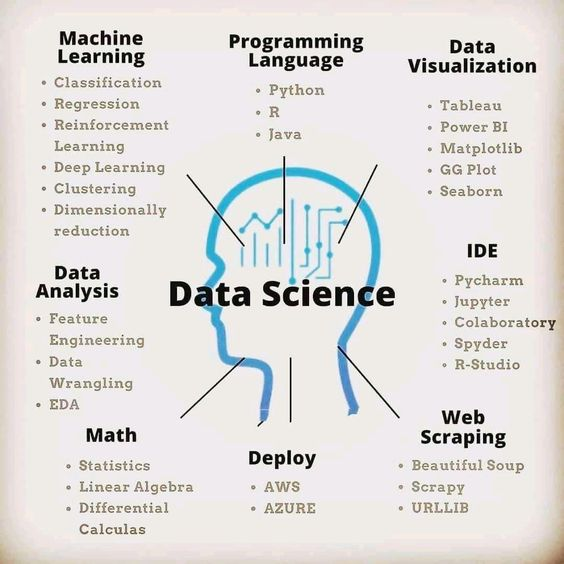
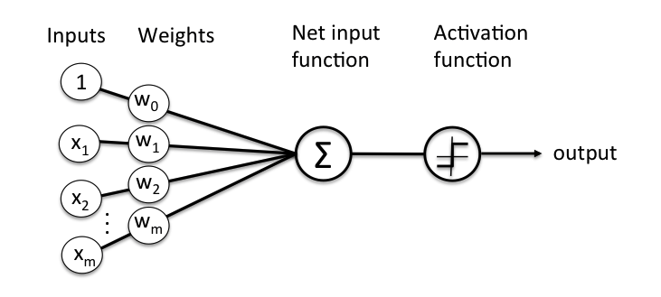
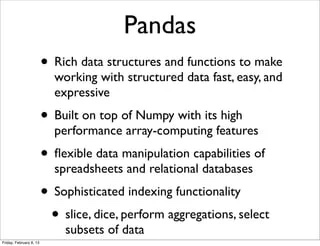

#  Data science 

*this is a broad field which is relevent for any kind of analytical work these days*

AI is currently split into two main categories 

- Classical Machine Learning 

- Deep Neural networks 

## brief level overview of what is data science 

- **scrapping data** 

    Data is all around us in this day and age of Internet and Internet of things . We can leverage data thats publically available for doing a lot of work . Since i am very much interested in Stock market analysis . let me walk you through a interesting library i came across for just this .

        -  https://github.com/jugaad-py/jugaad-data

        -   pip install jugaad-data

- **cleaning data & warehousing data** 

    -   pandas library 

        

- **modeling & prediction** 

    - sklearn

    

    

