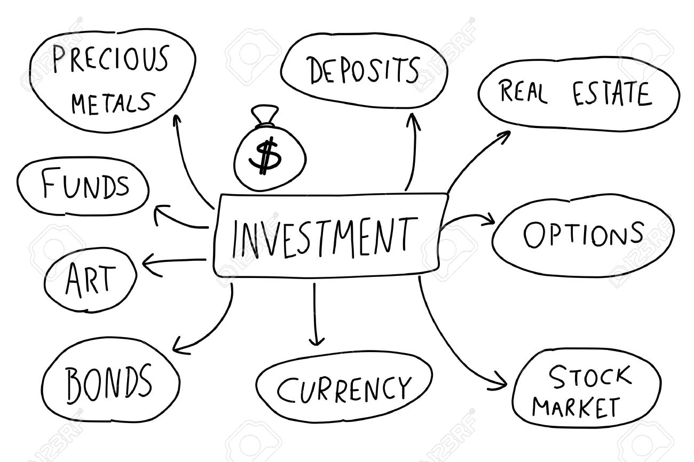

# Stock Market Analysis

Stock analysis is the evaluation of a particular trading instrument, an investment sector, or the
market as a whole. Stock analysts attempt to determine the future activity of an instrument, sector,
or market. There are two basic types of stock analysis: fundamental analysis and technical analysis.

## Fundamental Analysis

Fundamental analysis is the key to understanding the relative position of the company&#39;s stock to its
fair value. This involves measuring and evaluating the key ratios of the company against its past
performance as well as against its peers and industry average. 
Fundamental analysis uses various tools like 

- financial reports
- the earnings of the company 
as well as the financial ratios like 

- PE Ratio
- PB ratio
- debt equity ratio
- return on capital employed (ROCE) 
- return on equity (ROE), etc.

All the above assess the intrinsic value of the company. If the market price of the company is higher than the
**intrinsic value then the stock is considered to be overvalued**. On the other hand, if the market price
of the stock is lower than the fair value of the shares, **the stock is considered to be undervalued.**

## Technical Analysis

Technical analysis uses market data to forecast securities likely future price movement 

- such as astock or currency pair. 

It is based on the notion that historical trading activity and price movements
in the securities can be used as meaningful indications. 
When paired with appropriate trading or investment criteria, these indicators may aid in predicting market fluctuations in the future.
Technical analysis uses charts to spot trends and patterns in prices. There are three types of trends:
uptrend (prices go up), downtrend (prices go down), and sideways (prices move within a range).
Support and resistance levels show potential price reversals. Fibonacci retracement uses specific
ratios to find support and resistance. While technical analysis can be helpful, it cant predict prices
with certainty. So risk management strategies are an integral part of technical analysis.

